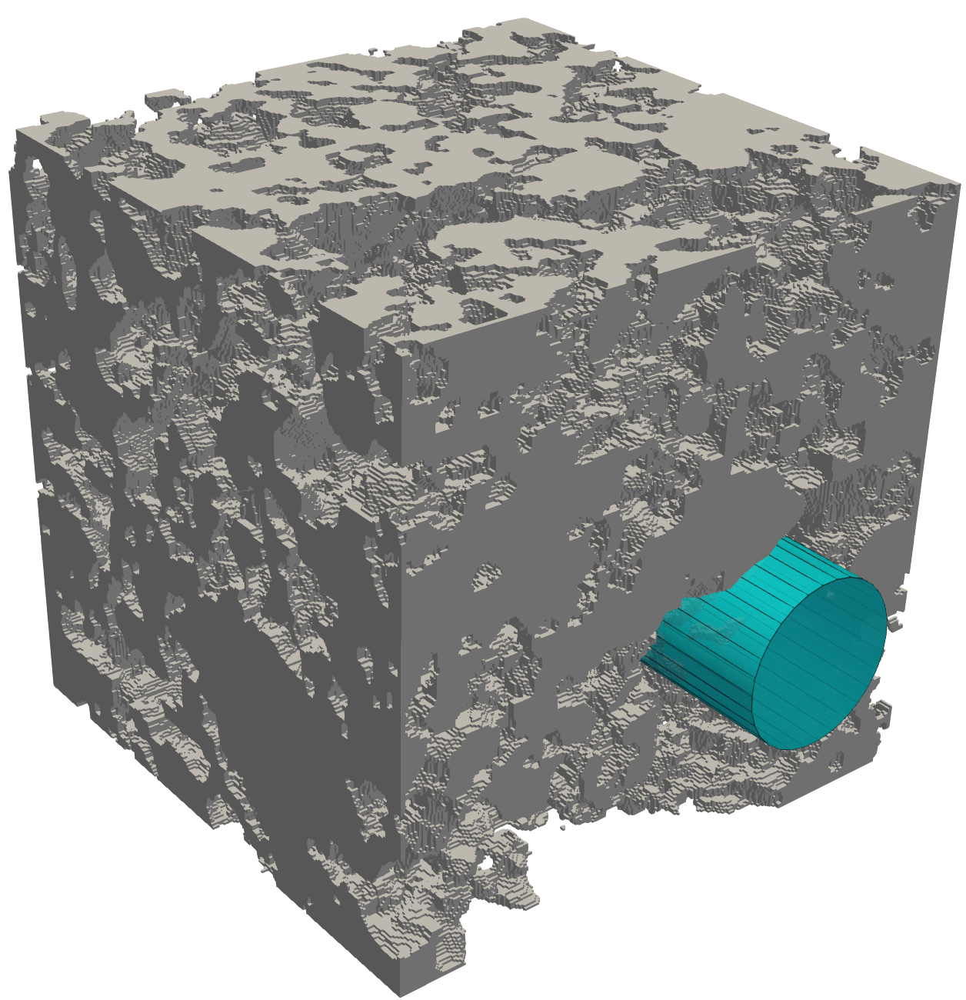
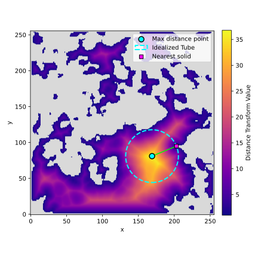
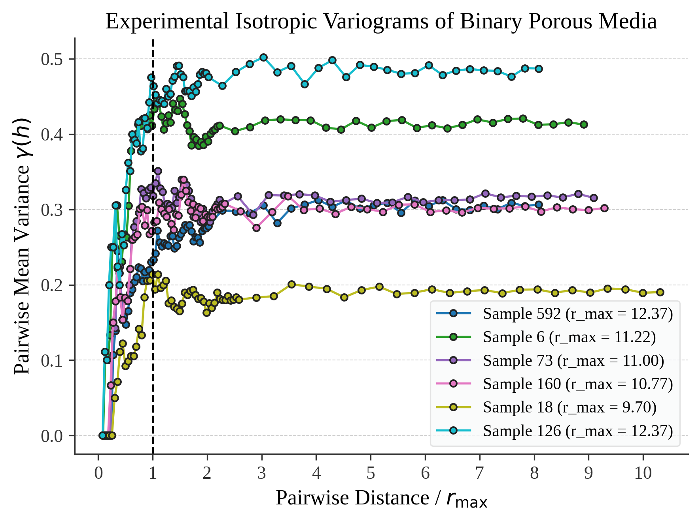

# Data Requirements for Porous Media Flow Simulations Dataset

In light of the training process for neural networks, the following requirements were stipulated regarding the data for creating the dataset with simulations of flow in porous media.

* The domains must be relevant to **petroleum extraction in porous rocks**.
* The flow must be situated in the **Reynolds regime $<< 1$**.
* The flow must be situated in the **Darcy regime**.
* The flow conditions must be defined **systematically** so that they are predictable and replicable for an arbitrary domain.
* The data must be made publicly available as a **Pytorch dataset**.
* The total size, including geometries and simulations, must be **less than 3 terabytes (TB)** to be hosted on the HuggingFace platform.

These requirements aim to represent computational and fluid mechanics aspects applied to petroleum engineering. From this perspective, this section describes the methodology used to create the database.

---

## Methodology for Database Creation

The established database used the domains presented by \cite{rabbani2020deepore}, which is composed of **60 rocks with different formations**. Furthermore, due to the texture interpolation and porosity control method, the domains used are representative of flows with different properties pertinent to oil extraction.

### Determining Flow Conditions

To define the flow conditions, the following possible methodologies were evaluated:

* **Define an arbitrarily small force for each rock** as deviation from the desired Darcy and Reynolds regimes was detected. However, this methodology makes reproducibility unfeasible, as the user would not know the conditions under which the prediction would be provided for a sample, thus preventing the calculation of permeability.
* **Define an arbitrarily small and constant force across all samples**. This choice would require a force low enough to ensure the most porous samples remain within the regimes. Aside from the excessive time required to finish the simulations during dataset creation, the user could still execute a prediction on a rock less permeable than those used to set the constant force, potentially exiting the Darcy regime.
* **Define a variable force across the samples, established systematically and based only on the input geometry**. This way, a user in possession of a given geometry must be able to accurately obtain the flow conditions under which the prediction is made.

Thus, the **variable forces methodology** was used for database creation. This methodology aims to preserve the arbitrary characteristic of the input geometry for the neural network application, enabling prediction within the same flow regime independently of porosity or tortuosity.

### Ensuring the Desired Regime

To ensure the desired flow regime, the definition of the **Reynolds number ($Re$)** for a cylindrical pipe \citep{huinink2016fluids} was used, as shown in Equation (1):

$$
Re = \frac{\rho r^{3}}{8\mu^{2}} \left|\frac{\Delta p}{\Delta x} - g_x \right| \quad (1)
$$

where $\rho$ is the density, $\mu$ is the viscosity, $r$ is the equivalent pipe radius, and $g_x$ is the body force (or field force). 

For creating the database in the same flow regime, the **pipe radius ($r$)** was defined as equal to the **maximum value of the distance transform in the rock ($r_{max}$)**. The Reynolds number was determined based on what is observed in typical porous media experiments, which is **$Re \ll 1$**. To stipulate the force, a maximum Reynolds number $\left(Re_{max}\right)$ of **$0.1$** was used.

  
  

The fluid viscosity ($\mu$) in lattice units is conditioned by the LBM parameter $\tau$, according to Equation (2), and was adopted as the upper limit of $1.5$ in the software used \citep{mcclure2021lbpm}, being constant across all samples. Finally, the density $\rho$ in lattice units is constant and unitary in LBM simulations due to isochoric flow.

$$
\mu = \frac{(\tau-0.5)}{3} \quad (2)
$$

The choice of viscosity does not interfere with the resulting permeability, as the latter is a geometric attribute of the sample.

Thus, in lattice units, we can attribute the **body force ($g_x$)** that conditions the flow, without imposing a pressure difference ($\Delta p = 0$), according to Equation (3):

$$
g_x = \frac{Re_{max} 8 (\tau-0.5)^2}{9 \rho r_{max}^3} = \frac{0.8}{9r_{max}^3} \quad (3)
$$

where $r_{max}$ is the maximum value of the distance transform in the sample.

Thus, it is evident that the force that conditions the flow is dependent **only on the geometry of the sample**.

The use of $r_{max}$ is justified because it generates an **overestimation** of the Reynolds number, i.e., an upper limit. This ensures that the simulations are in the $Re \ll 1$ regime and, consequently, in the **Darcy regime**. Another perspective on the choice of $r_{max}$ is its relationship with the correlation length observed in statistical experiments. The maximum distance transform value $r_{max}$ serves as an estimate for the **correlation length**, the distance at which the variogram curve reaches a plateau (sill).

    

---

## Procedure for Flow Determination

The procedure used to determine the flow conditions for a given 3D rock image in this work is:

1.  **Establish a binarized 3D rock image**, where pores are unitary values and solids are zeros.
2.  **Encapsulate the rock with solids at the interfaces**, allowing flow only at the inlet and outlet interfaces along the $z$-axis.
3.  **Compute the distance transform** in the porous space. 
4.  **Locate the maximum distance transform value** ($r_{max}$) and set this value as the equivalent pipe radius.
5.  **Calculate the force $g_x$** required for the Reynolds number in the equivalent pipe to be $Re_{max}$ (Equation (3)).
6.  **Simulate the flow** under these conditions or perform a prediction via a neural network.
7.  **Calculate the permeability** proportional to the imposed force $g_x$.

Under these conditions, **17,700 LBM simulations** were performed using the code available from \cite{mcclure2021lbpm}.

Below is an example of the LBPM input (Figure 1), referring to sample 525 of the database, with a maximum distance transform value of $36.77$, which requires applying a force of $1.788 \times 10^{-6}$ in lattice units, according to Equation (3).

<kbd>
 
MRT {  
tau = 1.5  
din = 0.0 // inlet density (controls pressure)  
dout = 0.0 // outlet density (controls pressure)  
F = 0, 0, 1.78806e-06 // Fx, Fy, Fz  
timestepMax = 100000000 tolerance = 1e-06 
} 
 
Domain {  
Filename = "domain.raw"  
ReadType = "8bit" // data type  
nproc = 1, 1, 4  
n = 256, 256, 64  
N = 256, 256, 256  
offset = 0, 0, 0 // offset to read sub-domain  
voxel_length = 1 // voxel length (in microns)  
ReadValues = 0, 1 // labels within the original image  
WriteValues = 0, 1 // associated labels to be used by LBPM (0:solid, 1..N:fluids) 
BC = 5 // boundary condition type (0 for periodic)  
InletLayers = 0, 0, 0 // specify layers along the inlet  
OutletLayers = 0, 0, 0 // specify layers along the outlet  
} 
 
Visualization {  
format = "vtk"  
write_silo = true // SILO databases with assigned variables s 
ave_8bit_raw = true // labeled 8-bit binary files with phase assignments  
save_phase_field = true // phase field within SILO database s 
ave_pressure = true // pressure field within SILO database  
save_velocity = true // velocity field within SILO database } 
 
Analysis { 
analysis_interval = 5000 // logging interval for timelog.csv  
subphase_analysis_interval = 100000000 // logging interval for subphase.csv N  
_threads = 0 // number of analysis threads (GPU version only)  
visualization_interval = 100000000 // interval to write visualization files  
restart_interval = 100000000 // interval to write restart file  
restart_file = "Restart" // base name of restart file }  
 
</kbd>

---

## Validation of Flow Regimes

The value of $Re_{max}$ was calculated using the resulting velocity fields to verify the database's behavior regarding the Reynolds regime, according to Equation (4):

$$
Re = \frac{\rho \bar{u} r_{max}}{\mu} \quad (4)
$$

where $\bar{u}$ is the average velocity in the porous space. The definition of the Reynolds number as a function of the maximum pore size is not standard in the literature but is consistent with the goal of comparing it to the imposed Reynolds regime.

Among the simulations, observed $Re$ values were an average of **$0.0040$** with a standard deviation of **$0.0030$**. Thus, the simulations systematically meet the objective of remaining below a unitary Reynolds number. Moreover, the observed Reynolds number is expected to be significantly smaller than the $Re_{max}$ reference, as the samples have channels narrower than $r_{max}$ and paths more tortuous than ideal cylindrical pipes.

The **Darcy regime** for the database is expected to be ensured by the low Reynolds number used. To verify the validity of this assumption, 170 random samples (about $1\%$ of the total simulations) were selected for simulations with forces **100 times greater** than initially stipulated. It was observed that the difference in the resulting permeability was $XX$ on average with $xx$ standard deviation. Thus, even with forces orders of magnitude greater, the simulations still have similar permeabilities, showing that permeability is approximately constant and that the force criterion used also ensures the Darcy regime.

Another relationship expected from the definition of the Reynolds number based on the maximum pore diameter (Equation (4)) is that the observed mean velocity should scale inversely proportional to the maximum pore diameter for flows with same Reynolds number, viscosity, and density.

---

## Data Storage Strategy

To reduce the storage cost of the simulation set, it was decided to record information only for the porous spaces, limited to **half of the volumetric domain**, where the relevant values exist.

For each voxel, the following was used: **three float16 for velocity values**, **three uint8 for coordinates and distance transform**, and **one uint32 to represent the number of porous voxels** per sample. Since uint8, uint32, and float16 use $1$, $4$, and $2$ bytes, respectively, the total consumption becomes:

$$
(4 \times 2 + 3 \times 1)\times \frac{256^3}{2} + 1 \times 4 \approx 5.5\,\times 256^3 \text{ bytes / sample}
$$

In comparison, storing three \texttt{float16} across the entire domain would require:

$$
(4 \times 2) \times 256^3 = 8 \times 256^3 \text{ bytes / sample}
$$

This is about **$45\%$ more memory**. Therefore, the first strategy is more efficient, retaining the same essential information with lower storage demand, although it requires domain reconstruction before use.

The limitation to $50\%$ of the sample volume was determined based on the samples used, with the largest porosity observed in the DeePore image database being $7,560,816$ porous voxels, or $45.066\%$ of the total volume of $256^3$ voxels.

* The choice of **uint8 for coordinates** is justified as it represents values between $0$ and $255$, equal to the coordinates of a $256^3$ array.
* The **uint32 type** was chosen to represent values between $0$ and $4,294,967,295$, the smallest unsigned integer type greater than the maximum number of porous voxels ($8,388,608$).
* **float16 data** was used for the distance transform and velocities, representing values between $-65504$ and $65504$, with the smallest non-zero modulus being $5.96046 \times 10^{-8}$.
